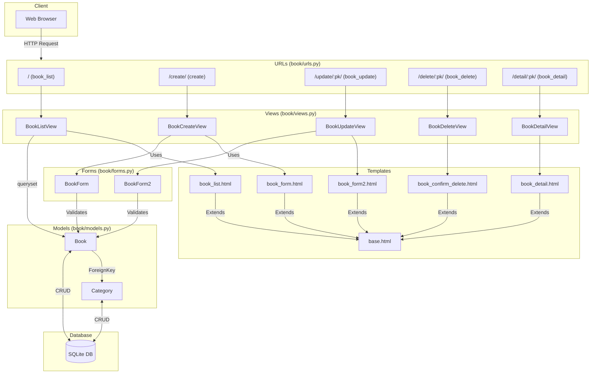

[English](Readme.md) | 日本語

<p align="left">
  
  
  
  
</p>

# Django Bookshelf

このリポジトリには、**プログラミング言語II Python**の最終課題である。

このプロジェクトは、Djangoを使用して構築された書籍管理システムであり、研究室や学習環境で使用することを目的としています。

## 📌 Features
- Django 3.2.16で構築
- django-bootstrap5を使用したスタイリング
- カテゴリ管理用の管理パネルを含む
- データベースの初期化不要（SQLiteを使用）
- `pip install -r requirements.txt`で簡単にインストール
- `python manage.py runserver`でローカルで実行

## ⚙️ Installation & Setup

### 前提条件
- Python 3.x
- pip (Python package manager)

### セットアップ

1. **リポジトリをクローンする**:
   ```sh
   git clone https://github.com/cuajarsaki/django-bookshelf.git
   cd django-bookshelf]
   ```
   
2. **依存関係をインストールする:**
   ```sh
   pip install -r requirements.txt
   ```
   
3. **開発サーバーを実行する:**
   ```sh
   python manage.py runserver
   ```
   
4. **アプリケーションにアクセスする:**
- Open `http://127.0.0.1:8000/` to view the book management system.
- To access the admin panel, go to `http://127.0.0.1:8000/admin`
- Admin credentials:
- Username: `admin`
- Password: `test_1234`

## 🖥️ 実行画面


## 🛠️ 構造



## ⚠️ データベース管理
- このプロジェクトは、デフォルトのデータベースとしてSQLiteを使用しています。
- データベースをリセットするには、プロジェクトディレクトリからdb.sqlite3ファイルを削除します。

## 🏗️ 技術スタック
- Django 3.2.16
- django-bootstrap-form
- django-bootstrap5
- dj-static
- python-decouple

## 🤔考慮事項
このプロジェクトでDjangoをBottleの代わりに選んだ理由：

1. Djangoはウェブアプリケーション向けの多くの組み込み機能を提供
2. 高いセキュリティ対策
3. 高いスケーラビリティ
4. 良好なドキュメントとコミュニティサポート

さらに、カテゴリ管理機能は管理パネルを通じて簡単に編集できます。

## 🏫 この課題について
- コース：プログラミング言語II（Python）
- 年度：2023
